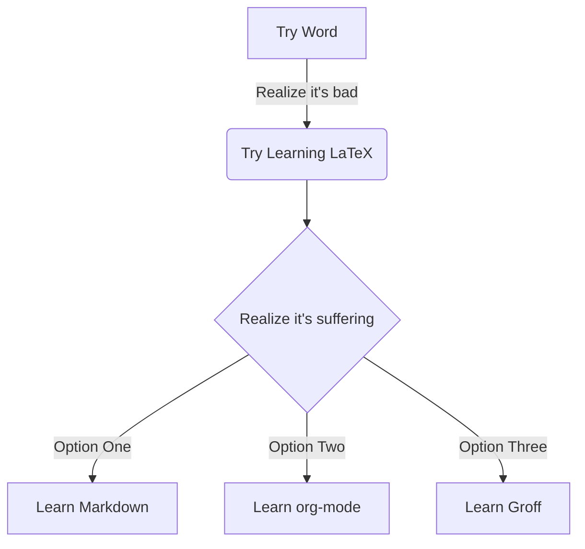
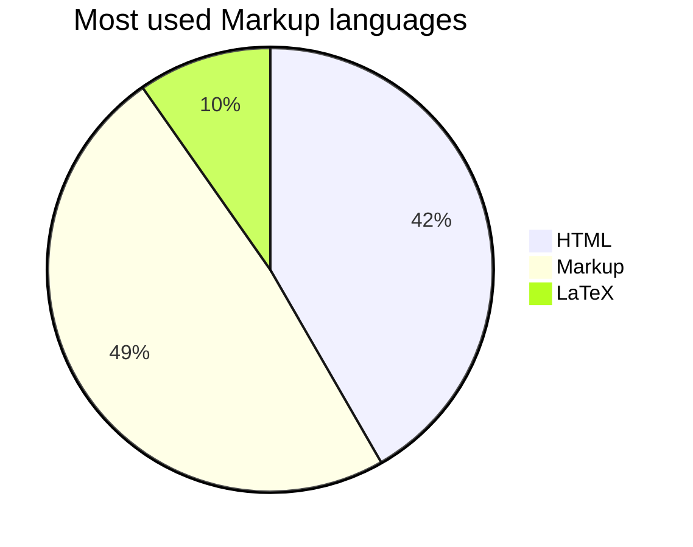

## Important notice: many of these aren't going to work with all flavours[^flavour]

<br>

<details><summary>Table of Contents</summary>

- [Basic text modifications](#basic-text-modifications)
  - [Horizontal rule/line](#horizontal-ruleline)
  - [Line break](#line-break)
- [Headings](#headings)
- [Blockquotes](#blockquotes)
- [Tables](#tables)
  - [Normal table](#normal-table)
    - [Multiline](#multiline)
- [Code](#code)
  - [Inline Code](#inline-code)
  - [Syntax Highlighted, Line Numbers and Line Highlight Fenced Code](#syntax-highlighted-line-numbers-and-line-highlight-fenced-code)
    - [Enable line number with {.line-numbers}](#enable-line-number-with-line-numbers)
    - [Enable line highlight with {.highlight=}](#enable-line-highlight-with-highlight)
- [Links](#links)
  - [Automatic email mailto: link](#automatic-email-mailto-link)
  - [Reference links](#reference-links)
    - [Image link](#image-link)
- [Images](#images)
- [Lists](#lists)
  - [Unordered lists](#unordered-lists)
    - [Ordered lists](#ordered-lists)
    - [Checklists](#checklists)
    - [Definition Lists](#definition-lists)
- [Custom Heading id/class](#custom-heading-idclass-custom-id)
- [Comments](#comments)
- [Collapsible](#collapsible)
- [Table of Contents](#table-of-contents)
- [Abbreviations](#abbreviations)
- [Metadata/Front Matter](#metadatafront-matter)
- [MermaidJS/Charts](#mermaidjscharts)
- [Math/LaTeX/KaTeX](#mathlatexkatex)
- [Footnotes](#footnotes)

</details>

<br>

## Basic text modifications

|          Type          |              Syntax               |             Render             |
|:----------------------:|:---------------------------------:|:------------------------------:|
|    Bold/Strong Text    |            `**bold**`             |            **bold**            |
| Italic/Emphasised Text |            `*italic*`             |            *italic*            |
|      Superscript       |              `12^2^`              |             12^2^              |
|         Emotes         |            `:flushed:`            |           :flushed:            |
|    Keyboard Buttons    | `<kbd>CTRL</kbd> + <kbd>Z</kbd>`  | <kbd>CTRL</kbd> + <kbd>Z</kbd> |
|       Highlight        |            `==Mark==`             |            ==Mark==            |
|       Subscript        |              `H~2~O`              |             H~2~O              |
|   Escape Characters    | `\*escaping\*` and `&#124;` pipes | \*escaping\* and &#124; pipes  |
|  Strikethroughed Text  |        `~~strikethrough~~`        |       ~~strikethrough~~        |

### Horizontal rule/line

Put `<hr>`, `***` or `---`.

---

### Line break

Put `<br>` or end a line with two spaces.

## Headings

```
# Heading 1
## Heading 2
### Heading 3
#### Heading 4
##### Heading 5
###### Heading 6
```

## Blockquotes

`> This is how you make a blockquote`

> This is how you make a blockquote

```
> You
>> Can
>>> Also nest them
>>>> Space after > is good practice
>>>> Add **text modifications**
> - Even lists
> - Listception with the correct indention
```

> You
>> Can
>>> Also nest them
>>>> Space after \> is good practice
>>>> Add **text modifications**
> - Even lists
>   - Listception with the correct indention

## Tables

### Normal table

```
| Left-Aligned |  Centered  | Right-Aligned |
|:-------------|:----------:|--------------:|
| It all       | depends on |    the colons |
```

#### Multiline

Put `<br>` where you want the line break.

|      Type       |           Syntax            |         Render          |
|:---------------:|:---------------------------:|:-----------------------:|
| Multiline table | Fancy`<br>`pants`<br>`table | Fancy<br>pants<br>table |

## Code

### Inline Code

\`Encase something in backticks\`
`Encase something in backticks`

### Syntax Highlighted, Line Numbers and Line Highlight Fenced Code

\```language {.custom-property-1, custom-property-2}
// Code
\```

#### Enable line number with `{.line-numbers}`

#### Enable line highlight with `{.highlight=}`

```css {.line-numbers, highlight=3-5}
blockquote {
	background-color: rgba(227, 91, 21, 0.1) !important;
	color: var(--text, #e4cbb3) !important;
	font-style: italic !important;
	border-left: 3.5px solid var(--ui, #e35b15) !important;
}
```

## Links

`[text](link "onhover")`

`This is a [Useful site](https://www.markdownguide.org/basic-syntax/ "Markdown cheatsheet").`
This is a [Useful site](https://www.markdownguide.org/basic-syntax/ "Markdown cheatsheet").

### Automatic email mailto: link

\<fake@example.mail\>
<fake@example.mail>

### Reference links

`[text][1]`

`[1]: (link) "onhover"`

<br>

`[Markdown][1] is very useful.`

`[1]: (https://en.wikipedia.org/wiki/Markdown) "Markdown Language"`

[Markdown][1] is very useful.

[1]: (https://en.wikipedia.org/wiki/Markdown) "Markdown Language"

#### Image link

Makes an image act as a link to something when you click on it.[^exo]

`[](link.onclick)`

[](https://gitlab.com/exorcist365)

## Images

\!\[alt](image.link "onhover")


if you guys have a kitteh pls send a pic cuz not sure if this is gpl

## Lists

### Unordered lists

```
- This is an unordered list that uses -
- You can't mix * with -
  - Nest them
  - > Blockquotes
  - [x] Even checklists can be nested
  - [ ] Unmarked ones as well
- - Weird nesting with two -

+ You can also use +

* This is also an unordered list but it uses *
  - And also nest them with either * or -
* - - Putting multiple * gives weird results
```

- This is an unordered list that uses `-`
- You can't mix `*` with `-`
  - Nest them
  - > Blockquotes
  - [x] Even checklists can be nested
  - [ ] Unmarked ones as well
- - Weird nesting with two `-`

- You can also use `+`

- This is also an unordered list but it uses `*`
  - And also nest them with either `*` or `-`
- - - Putting multiple `*` gives weird results

#### Ordered lists

1. Ordered list with 1.
2. Now it's with 2.
     1) You can also use 1) but it gets rendered as 1.

#### Checklists

```
- [ ] Task to do
- [x] Finished task
* [x] ~~Crossed out with *~~
```

- [ ] Task to do
- [x] Finished task
- [x] ~~Crossed out with \*~~

#### Definition Lists

```
Text
: Definition
```

Markdown
: A very nice language for writing documents in.

LaTeX
: An advanced markup language.
: Difficult to read.

## Custom Heading id/class {#custom-id}

```
## Custom Heading id {#custom-id}
## Custom Heading class {.custom-class}
```

## Comments

`[\\]: # "comment"`

## Collapsible

<details>
  <summary>Click to Expand!</summary>

`<details>`
`<summary>Click to Expand!</summary>`
`content`
`<\details>`

</details>

## Table of Contents

Some markdown editors support automatic Table of Contents generation or a tag like `[TOC]`. You can make one by hand if you link to the heading id (usually is the same as the heading itself) in a list.

`## Table of Contents` -> `#table-of-contents`

`- [text](#id)`

```
- [Table of Contents](#table-of-contents)
- [MermaidJS](#mermaidjscharts)
```

- [Table of Contents](#table-of-contents)
- [MermaidJS](#mermaidjscharts)

## Abbreviations

Shows meaning on hover.

`*[Abbreviation]: Meaning`

*[Abbreviation]: Meaning

Abbreviation is a great word.

## Metadata/Front Matter

If you're converting your Markdown into something like LaTeX, you might want to put some metadata like author, date, title, theme and others.

```yaml
---
title: Noob to Pro Markdown Guide
author: Kyle
---
```

## MermaidJS/Charts

[Fancy](https://mermaid-js.github.io/mermaid/) JavaScript to make all kinds of charts.[^charts]



<br>



\```mermaid
graph TD
A[Try Word] -->|Realize it's bad| B(Try Learning LaTeX)
B --> C{Realize it's suffering}
C -->|Option One| D[Learn Markdown]
C -->|Option Two| E[Learn org-mode]
C -->|Option Three| F[Learn Groff]
\```

\```mermaid
pie
title Most used Markup languages
"HTML" : 42.96
"Markup" : 50.05
"LaTeX" : 10.01
\```

## Math/LaTeX/KaTeX

[Fancy](https://katex.org) JavaScript allows you to render LaTeX with Markdown if you encase it in \$.
Single \$ is inline, double \$$ is a block.

`$$\alpha = \beta \rightarrow + Very_{fancy}$$`
$$\alpha = \beta \rightarrow + Very_{fancy}$$

## Footnotes

`A simple footnote[^2]. Here is a more elaborate footnote[^large]. And an inline one^[Nifty for short notes]`

A simple footnote[^2]. Here is a more elaborate footnote[^large]. And an inline one^[Nifty for short notes]

[^flavour]:
    The feature configuration your markdown has, many exist like CommonMark, GitHub Flavoured Markdown, Markdown-it and [many others](https://github.com/commonmark/commonmark-spec/wiki/Markdown-Flavors).
    I use the [VSCode/Atom Markdown Preview Enhanced](https://shd101wyy.github.io/markdown-preview-enhanced/#/) extension and everything in this guide works.

[^2]: The simple footnote.
[^charts]: Data shown may not be true.
[^exo]: Credit for kitteh goes to [exo](https://gitlab.com/exorcist365), give him a star.
[^large]:
    Here is one with several elements.
    You can even make them very large!

    > Even quotes and other elements if you **indent** them correctly!
